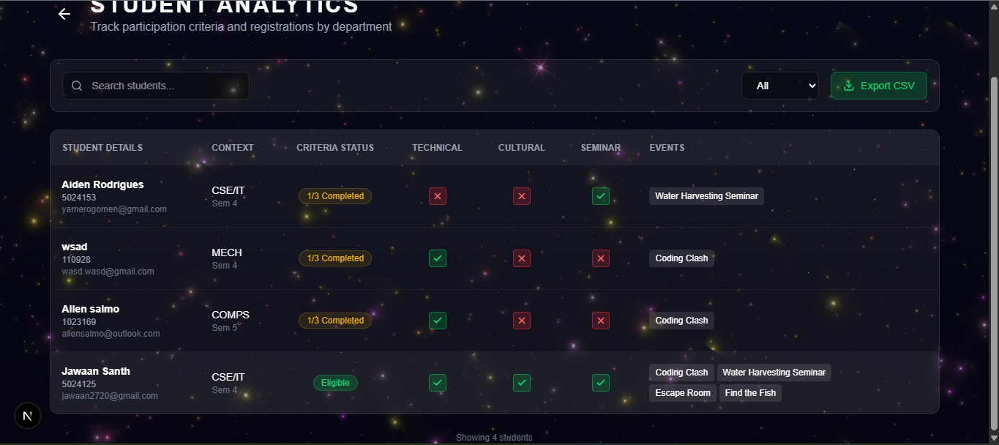
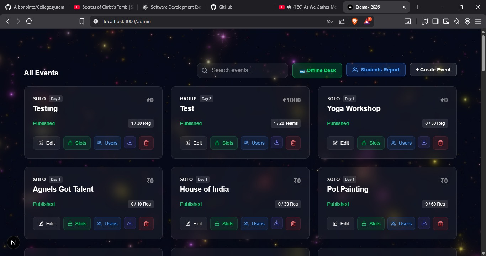
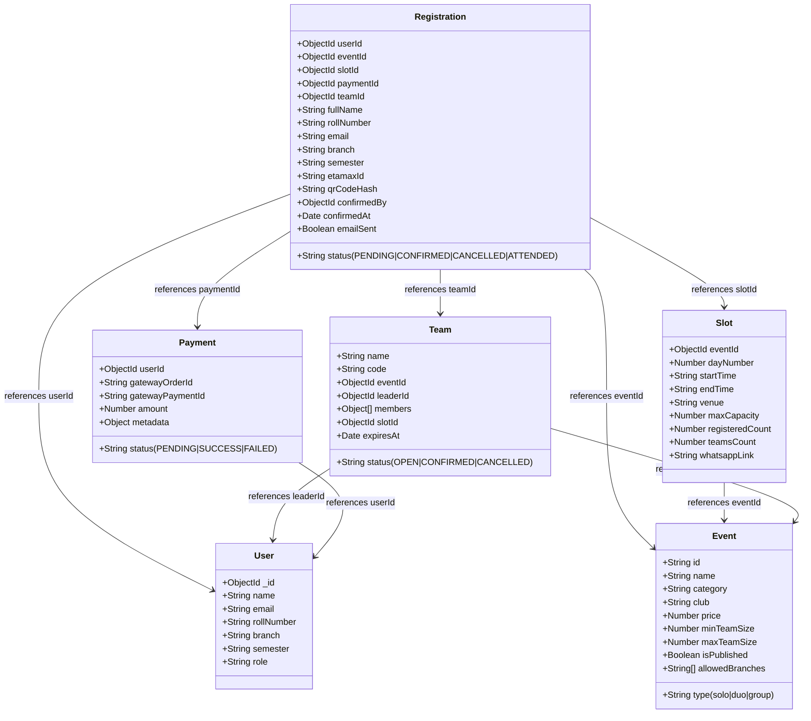
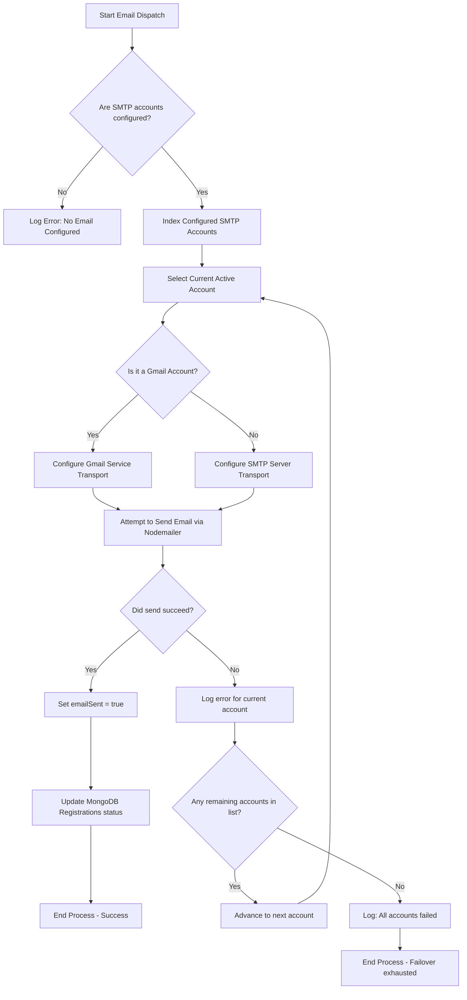
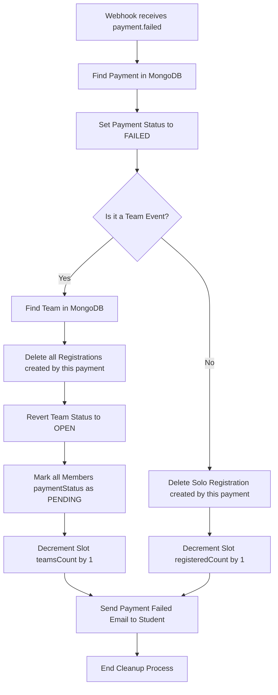

# 🌌 Etamax 2026 - Official College Fest Platform

Welcome to the official repository for **Etamax 2026**, the annual cultural, technical, and sports festival platform. This custom-built software serves as the central mission control, orchestrating student registrations, team collaborations, secure payment gates, real-time ticket allocation, and comprehensive administrative command centers.

Designed with an immersive **Galaxy & Space exploration theme**, the platform uses dark backgrounds, neon accents, and canvas-based animations to deliver a premium user experience.

---

## 🚀 Technical Highlights & Badges

[-blueviolet?style=for-the-badge&logo=nextdotjs&logoColor=white)](https://nextjs.org/)
[](https://tailwindcss.com/)
[](https://www.mongodb.com/)
[](https://razorpay.com/)
[](https://upstash.com/)
[](https://etamax2026.in)

---

## 📸 Screenshots & System Showcase

### 📊 Real-time Student Analytics View
Tracks participation checks, event registrations by category, and student departments in a glassmorphic space layout.


### 🪐 Events Dashboard & Management
A control panel for event admins to edit slot timetables, create new events, access the offline registry desk, and export reports.


### 🎥 System Demonstration Video
Watch the checkout flow, team creation, slot selection, and webhook payment confirmation in action:


---

## 🌟 Key Features

### 👨‍🚀 For Students (The Explorers)
*   **Cosmic UI/UX**: Immersive space backgrounds, animated particles (`Galaxy.jsx`), and smooth page transitions powered by `Framer Motion`.
*   **Dynamic Registration**: Real-time event search and filtering by Category (Technical, Cultural, Sports) and Type (Solo, Duo, Group).
*   **Team Workspace**: Create and manage custom teams for group events through a dedicated "My Teams" control panel.
*   **Secure Payment Pipeline**: Automated **Razorpay** integration with instant webhook verification to confirm slots.
*   **Master Receipts**: PDF receipt generation containing event-specific entry slots and criteria validation.
*   **Participation Checkers**: Visual progress trackers showing whether a student meets requirements (e.g., minimum solo/group registrations).

### 🛡️ For Administrators (The Controllers)
*   **Real-time Analytics**: Interactive charts showing total registrants, revenue breakdown, and check-in metrics.
*   **Flexible Event Architect**: Create, modify, and delete events with dynamic pricing, slot sizes, and schedules on the fly.
*   **Rapid Offline Desk**: A specialized "Rapid Payment" interface designed to record on-the-spot cash payments at physical registration desks.
*   **Bulk Data Exports**: Download formatted PDF registers and Excel/CSV sheets for every event with a single click.
*   **Failover Email Notification**: A robust SMTP pipeline with automatic failover (switching between Hostinger and Google App passwords) to ensure registration receipts are always delivered.

---

## 💾 Database Schema Architecture

The data storage layer uses MongoDB Atlas structured through Mongoose ODM schemas.



### Key Schema Optimizations
*   **Compound Indexes**: A unique index on `{ userId: 1, eventId: 1 }` prevents duplicate student registrations for the same event at the database layer.
*   **Auditing Snapshot**: The `Registration` document stores a snapshot of `fullName`, `rollNumber`, `branch`, and `semester` at the time of ticket checkout, ensuring records remain accurate even if students modify their profiles later.
*   **Sparse Indexes**: `etamaxId` uses a sparse index to allow null values for pending checkouts while guaranteeing absolute uniqueness once confirmed.

---

## ⚙️ Core Architecture & Pipeline Workflows

The platform leverages Next.js App Router API endpoints combined with Razorpay webhook routing to offer transactional consistency and robust failovers.

### 1. Payment Lifecycle & Verification Flow
```mermaid
sequenceDiagram
    autonumber
    actor Student as Student (Browser)
    participant NextJS as Next.js Server Actions
    participant Mongo as MongoDB Atlas
    participant Razorpay as Razorpay API
    participant Webhook as Webhook Handler (/api/webhooks/razorpay)
    participant SMTP as SMTP Failover Engine

    Student->>NextJS: Choose Events & Click "Pay"
    NextJS->>Mongo: Create Payment Record (PENDING) & Reserve Slot Capacity
    NextJS->>Razorpay: Create Order ID
    Razorpay-->>NextJS: Return Order ID
    NextJS-->>Student: Initialize Razorpay Checkout Modal
    Student->>Razorpay: Complete Payment (UPI/Card)
    Razorpay->>Webhook: HTTP POST Webhook (payment.captured)
    Note over Webhook: Validate Signature (HMAC-SHA256)
    alt Signature is Valid
        Webhook->>Mongo: Update Payment Status to SUCCESS
        Webhook->>Mongo: Confirm Registrations (Generate ETAMAX IDs & QR Hashes)
        Webhook->>SMTP: Trigger Email Dispatch
        loop SMTP Failover Cycle
            SMTP->>SMTP: Select Hostinger / Gmail SMTP Credentials
            SMTP->>Student: Send Confirmation Email with Master Receipt
            Note over SMTP: If success, break; if fail, rotate to next account
        end
        SMTP-->>Mongo: Update registrations with emailSent = true
        Webhook-->>Razorpay: 200 OK Response
    else Signature Invalid
        Webhook-->>Razorpay: 400 Bad Request
    end
```

### 2. SMTP Failover & Rotation Engine
To handle bulk confirmation emails and avoid hitting server-specific limit caps, the server rotates through multiple SMTP accounts automatically:


### 3. Database Integrity & Capacity Rollback
When transactions fail or are cancelled, the system automatically self-heals by rolling back reservations and releasing ticket capacities:


---

## 🧬 Business & System Rules

### 🎓 Student Event Participation Criteria
To earn completion and gain access to event WhatsApp groups, each student profile must satisfy the following dynamic checks evaluated in [criteria.ts](file:///d:/my%20study/Project/Etamax2026/src/lib/criteria.ts):
1.  **Day Coverage**: At least one confirmed registration on **Day 1**, **Day 2**, and **Day 3** of the festival.
2.  **Category Coverage**: At least one registration in each of the following categories: **Technical**, **Cultural**, and **Seminar**.
3.  **Team Engagement**: Minimum of one **Team Event** registration (solo-only profiles are flagged as pending).

### 🏦 Admin Offline Desk Cascades ("Leader Pays All")
The rapid offline cash payment desk utilizes a leader-driven model to process team transactions:
*   An admin searches for a student at the physical registration desk and selects their profile.
*   The system loads all pending event fees. For team events, **only the Team Leader** has an "Approve Cash" button.
*   Once the admin approves the leader's cash registration, the server cascades confirmation to **all other team members**, automatically generating their respective `Registration` models, ETAMAX tickets, and QR verification hashes.

---

## 📂 Project Directory Structure

The repository is organized following clean, modular Next.js architecture guidelines:

```
Etamax2026/
├── docs/                      # Documentation and developer guides
│   └── failover-email-guide.md
├── nginx/                     # Reverse proxy and server configurations
├── public/                    # Static assets, branding, and showcases
│   └── assets/showcase/       # Demo video and screenshot assets
├── scripts/                   # Seeding, verification, and testing utilities
│   ├── check_env.js           # Validates current local environment variables
│   ├── seed-events.js         # Seeds the DB with official festival events
│   ├── test-email.js          # Tests nodemailer configurations
│   └── verify-mongo.js        # Tests MongoDB connection credentials
├── src/
│   ├── app/                   # Next.js App Router (Pages & API Endpoints)
│   │   ├── admin/             # Admin dashboard panels & analytics
│   │   ├── api/               # Server-side API endpoints & Razorpay webhooks
│   │   ├── events/            # Space-themed event explorer
│   │   ├── payment/           # Payment gateway checkout interface
│   │   └── profile/           # Student profile & registered events
│   ├── components/            # Reusable UI widgets and layout modules
│   │   ├── admin/             # Specialized panels (OfflineDeskPanel, QuickExport)
│   │   ├── ui/                # Core interactive elements (buttons, inputs)
│   │   ├── Galaxy.jsx         # Canvas-based background animation
│   │   └── TeamManager.jsx    # Component managing team creations
│   ├── data/                  # Event datasets and layout mappings
│   ├── hooks/                 # Custom React state hooks
│   ├── lib/                   # Database instance and auth handler singletons
│   ├── models/                # MongoDB Mongoose collection schemas
│   ├── server-actions/        # Secure server-side database mutation operations
│   └── utils/                 # General utility scripts and formats
├── .env.example               # Standard environment variable template
├── Dockerfile                 # Multi-stage production container setup
└── docker-compose.yml         # Local container development configuration
```

---

## 🛠️ Installation & Setup

Set up your local environment in minutes:

### 1. Clone the Space Station
```bash
git clone https://github.com/abhishekkulbainur/Etamax2026.git
cd Etamax2026
```

### 2. Install Core Dependencies
Ensure you have `Node.js 20+` installed:
```bash
npm install
```

### 3. Configure the Environment
Duplicate the environment template file and customize it:
```bash
cp .env.example .env.local
```
Open `.env.local` in your preferred editor and fill in your connection strings and api credentials:
*   `MONGODB_URI`: Connection string for Atlas or local MongoDB instance.
*   `JWT_SECRET`: Random string used to sign user auth tokens.
*   `RAZORPAY_KEY_ID`: API key from your Razorpay Dashboard.
*   `UPSTASH_REDIS_REST_URL`: Credentials for middleware request rate limiting.

### 4. Run Environment Diagnostics
Verify your credentials and databases are functional:
```bash
# Test MongoDB connection
node scripts/verify-mongo.js

# Check for missing environment variables
node scripts/check_env.js
```

### 5. Seed Initial Data
Populate your database with the default event schedule:
```bash
node scripts/seed-events.js
```

### 6. Launch the Launchpad (Development Server)
```bash
npm run dev
```
Open [http://localhost:3000](http://localhost:3000) to view your local space station!

---

## 🐳 Docker Deployment

The application features fully optimized Docker container configurations:

```bash
# Start Nginx, App, MongoDB, and Redis containers in detached mode
docker-compose up -d
```
The Docker setup compiles the Next.js app in `standalone` output mode to guarantee minimal container image sizing and maximum throughput.

---

## 🛡️ License & Copyright

This project is proprietary software custom-designed for **Etamax 2026**. All rights reserved.
